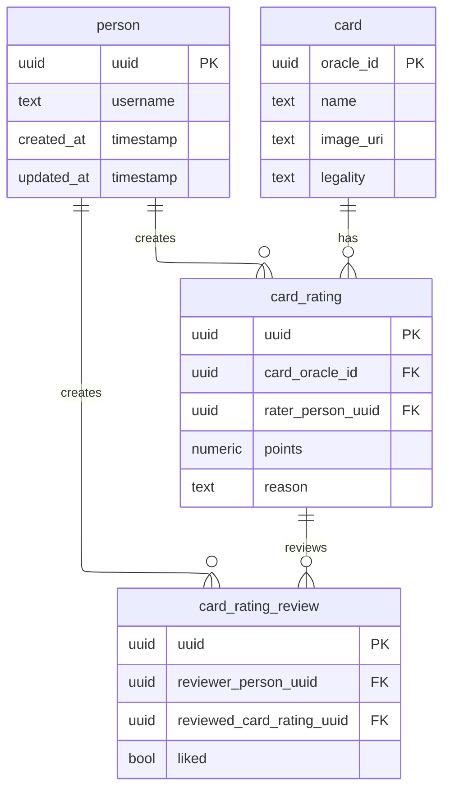

# Modeling

Additional constraints from the current schema:

- `card_rating` is unique on `(card_oracle_id, rater_person_uuid)`.
- `card_rating_review` is unique on `(reviewer_person_uuid, reviewed_card_rating_uuid)`.
